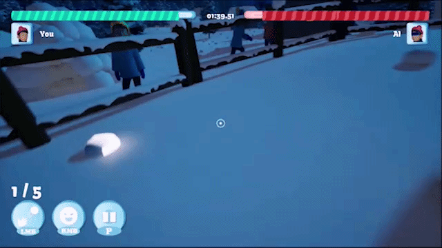

# The Aurora Snow Slingers



A third person snowball fighting game developed in **Unreal Engine 5.5.4** that explores gameplay programming, artificial intelligence, shader development, and modular gameplay systems.

The project was developed for the Aurora Game Jam, where I served as the sole gameplay programmer and technical developer. My responsibilities covered every gameplay system, AI behaviour, gameplay programming feature, technical art implementation, and engine integration, while the user interface artwork was designed by another team member.

---

## Project Overview

The Aurora Snow Slingers is a fast paced snowball arena game set during the polar night beneath the northern lights.

Players battle against an AI opponent inside an arena while managing a limited supply of snowballs, taking cover, avoiding incoming attacks, and racing against the match timer.

The project combines responsive third person gameplay with intelligent AI, environmental storytelling, and a custom aurora shader that establishes the visual identity of the game.

---

## Technical Summary

| Category | Details |
|----------|---------|
| Engine | Unreal Engine 5.5.4 |
| Programming | Blueprint Visual Scripting |
| Project Type | Third Person Action |
| AI | Behaviour Trees, EQS |
| Input | Enhanced Input |
| Graphics | Custom Aurora Shader |
| Architecture | Modular Blueprint System |
| Team Role | Sole Gameplay Programmer, Technical Artist |

---

# Gameplay Systems

## Snowball Inventory

The player carries a limited number of snowballs throughout each match.

The inventory system is responsible for:

* Tracking the current snowball count
* Reducing ammunition whenever a snowball is thrown
* Replenishing ammunition through pickups
* Updating the user interface in real time

This creates a lightweight resource management mechanic that encourages players to balance offence with exploration.

---

## Combat System

Combat revolves around throwing snowballs while avoiding incoming attacks from the opponent.

The gameplay system supports:

* Snowball throwing
* Hit detection
* Health management
* Damage feedback
* Victory and defeat conditions

Combat is tightly integrated with the AI behaviour system to create dynamic encounters throughout the match.

---

## Artificial Intelligence

Enemy behaviour is implemented using Unreal Engine's Behaviour Tree framework together with the Environment Query System (EQS).

The AI is capable of:

* Navigating the arena
* Finding strategic cover locations
* Throwing snowballs
* Pursuing the player
* Retreating when appropriate
* Reacting to different gameplay situations

The project also includes multiple AI difficulty levels, allowing enemy behaviour to scale naturally with the player's selected challenge.

This was my first complete implementation of an AI behaviour system using Behaviour Trees and EQS, and the experience became the technical foundation for later projects.

---

## Crowd System

To create a more lively arena atmosphere, a crowd system was implemented around the play area.

Spectators react throughout gameplay, helping reinforce the competitive feeling of the match while making the environment feel more active.

---

## Gameplay Timer

Each match runs against a fixed gameplay timer.

The timer system controls:

* Match duration
* Gameplay flow
* End of match conditions
* Transition to the results screen

---

# Aurora Shader

One of the primary technical goals of this project was creating the aurora effect that defines the atmosphere of the game.

A custom shader was developed to simulate the northern lights across the sky during the polar night.

The aurora is more than a background element. It serves as a central visual component that establishes the mood and identity of the entire experience.

Developing this shader introduced me to technical art workflows and real time material development inside Unreal Engine.

---

# User Interface

The gameplay interface is implemented using Unreal Motion Graphics (UMG).

Gameplay systems connected to the interface include:

* Health display
* Snowball inventory
* Gameplay timer
* Difficulty selection
* Mouse sensitivity settings
* Icon fade animations
* Gameplay feedback

A mouse sensitivity slider was also implemented, allowing players to adjust camera responsiveness directly from the settings menu.

---

# Blueprint Architecture

The project follows a modular Blueprint architecture where gameplay systems are separated into independent components with clearly defined responsibilities.

Core systems include:

* Player controller
* Combat
* Snowball inventory
* Artificial Intelligence
* Crowd behaviour
* Aurora shader integration
* Gameplay timer
* User Interface
* Difficulty management

This modular organisation made the project easier to expand while reducing dependencies between gameplay systems.

---

# Unreal Engine Features Used

* Blueprint Visual Scripting
* Behaviour Trees
* Environment Query System (EQS)
* Enhanced Input
* Animation Blueprints
* Blueprint Interfaces
* Niagara
* Physics
* Collision
* Materials and Shaders
* Widget Blueprints
* Unreal Motion Graphics (UMG)
* Trigger Events

---

# Technical Challenges

## Aurora Shader

Designing the aurora shader was one of the most technically rewarding aspects of the project.

The objective was to create a believable representation of the northern lights while maintaining real time performance inside Unreal Engine.

This project introduced me to shader development and expanded my understanding of technical art workflows.

---

## Artificial Intelligence

The AI system was another major milestone.

This was my first complete implementation of Behaviour Trees and Environment Query System (EQS), allowing opponents to navigate the arena, locate cover, attack intelligently, and adapt to different gameplay situations.

The knowledge gained from this project later became the foundation for the AI systems developed in **Lunch Fury**.

---

# Future Improvements

If I were to continue developing The Aurora Snow Slingers, the next major milestone would be adding an online multiplayer mode.

The current game focuses on player versus AI gameplay, but the underlying mechanics naturally lend themselves to competitive multiplayer.

Future work would include:

* Player versus player gameplay
* Network replication
* Client server architecture
* Online matchmaking
* Multiplayer session management
* Additional arenas
* Expanded progression systems

Building these systems would provide an opportunity to deepen my understanding of Unreal Engine's networking and multiplayer framework while significantly increasing the replayability of the game.

---

# Repository Structure

```
Config/
Content/
Source/
TheAuroraSnowSlingers.uproject
README.md
```

Generated Unreal Engine folders such as `Binaries`, `Intermediate`, `Saved`, and `DerivedDataCache` are intentionally excluded from source control.

---

# Skills Demonstrated

* Gameplay Programming
* AI Programming
* Behaviour Trees
* Environment Query System (EQS)
* Shader Development
* Technical Art
* Combat System Design
* Gameplay State Management
* User Interface Programming
* Blueprint Architecture
* Unreal Engine Development

---

# Author

**Temitope S. Falade**

Gameplay Programmer | Technical Animator | Technical Artist

Portfolio  
https://topson-noble.github.io/game-developer/the-aurora-snow-slingers.html

Game Portfolio  
https://topzone.itch.io/

LinkedIn  
https://www.linkedin.com/in/temitope-falade-578107120/
